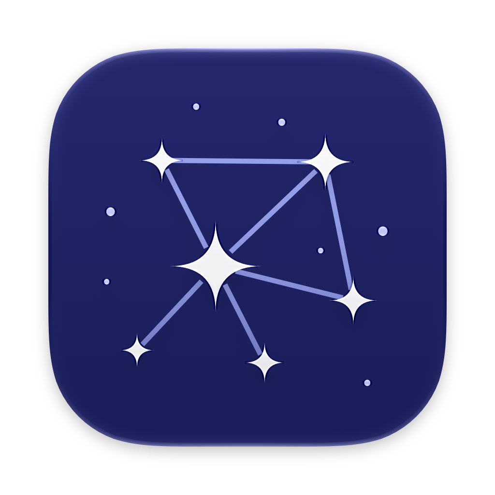

<!-- SPDX-FileCopyrightText: 2026 Nick Wolff <nick@wolff.tech> -->
<!-- SPDX-License-Identifier: GPL-3.0-only -->

<p align="center">
  
</p>

<h1 align="center">Constellation</h1>

<p align="center">
  A native macOS workspace for SSH, RDP, and VNC sessions in one window.
</p>

Constellation saves your remote machines and opens their sessions as tabs. SSH
uses [libghostty](https://github.com/ghostty-org/ghostty), RDP uses
[FreeRDP](https://github.com/FreeRDP/FreeRDP), and VNC uses
[RoyalVNCKit](https://github.com/royalapplications/royalvnc). Passwords and
passphrases are stored in the macOS Keychain.

> [!NOTE]
> Constellation does not create a VPN or relay traffic. Connect to your LAN,
> VPN, or Tailscale network before starting a session.

## Features

- Multiple addresses and connection profiles for each machine
- SSH tabs with a Metal-rendered terminal, fonts, themes, and your existing
  OpenSSH configuration, keys, and agent, optionally styled by your own
  Ghostty configuration
- RDP sessions with NLA, HiDPI rendering, shared clipboard text, and a trust
  store for accepted certificates
- VNC sessions in Constellation or Apple's Screen Sharing app
- Keychain-backed credentials and a workspace that restores open tabs

## Install

Constellation requires macOS 15 or later on Apple silicon.

1. Download the signed `.zip` from [GitHub Releases](https://github.com/WolffTech/constellation/releases) when one is available, or [build from source](#build-from-source).
2. Unzip it and move **Constellation.app** to **Applications**.
3. Open Constellation from **Applications** and add your first machine.

### Updates

Constellation checks GitHub Releases for updates with
[Sparkle](https://sparkle-project.org): use **Constellation → Check for
Updates…**, or turn on automatic checks in **Settings → Updates**. Every
0.x version is a beta; 1.0.0 will be the first stable release. In-app updating
only works after the app has been moved to **Applications** (macOS runs apps
launched from `~/Downloads` translocated, which Sparkle cannot update in
place).

## Build from source

Install Xcode 26 or later, then run:

```sh
brew install cmake xcodegen
xcodebuild -downloadComponent MetalToolchain
git clone --recurse-submodules https://github.com/WolffTech/constellation.git
cd constellation
Scripts/build-libghostty.sh
Scripts/build-freerdp.sh
xcodegen generate
open Constellation.xcodeproj
```

The build scripts download the pinned Zig toolchain and OpenSSL release, then
compile the pinned Ghostty and FreeRDP versions.

If you fork this repository and distribute your own builds, replace
`SUFeedURL` and `SUPublicEDKey` in `project.yml` with your own update feed and
Sparkle signing key. The committed values belong to the official releases, so
fork builds would otherwise try to update from this repository's feed.

## Releasing

Push a tag such as `v0.1.0` to publish a release. The Release workflow
builds, notarizes and staples the app, signs the zip for Sparkle, and attaches
the zip, its checksum, the corresponding source and `appcast.xml` to the
GitHub release. The app reads the appcast from the latest release, so every
tag is published as a full release, never a pre-release. The build number is
the commit count on the tag, which is also what Sparkle compares.

## License

Constellation is free software licensed under [GPL-3.0-only](LICENSE).
Third-party attributions are listed in
[THIRD_PARTY_NOTICES.md](THIRD_PARTY_NOTICES.md), and details about the source
archive included with each release are in [SOURCE.md](SOURCE.md).
